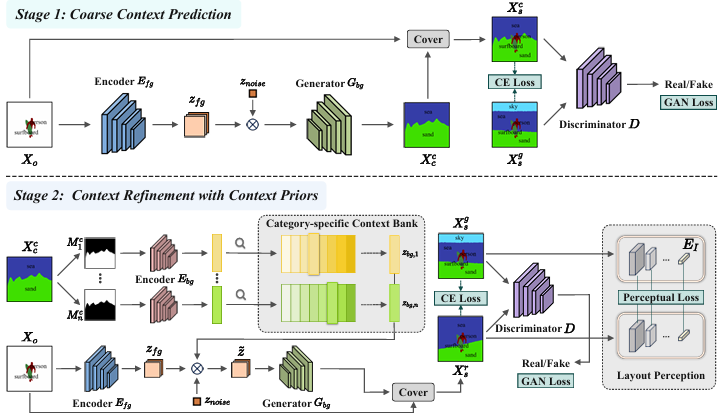

# ContX: Scene Context Prediction via Context Bank and Layout Perception

---



---

> **ContX: Scene Context Prediction via Context Bank and Layout Perception**
> 
Jingxin Liang, Yangyang Xu, Haorui Song, Yuqin Lu, Yuhui Deng, Yiyi Long, Yan Huang, Shengxin Liu, Jianbo Jiao, Shengfeng He
> 

> **Abstract:** Scene context prediction, which seeks to infer unknown contextual information from isolated object properties, currently faces limitations due to predominant reliance on pixel-wise supervision that overlooks real-world context priors. To address this, we present ContX, a context-prior-driven, coarse-to-fine model. ContX distinctively integrates explicit linguistic-contextual knowledge in two key ways. First, it proposes a linguistic guided context bank, leveraging linguistic-statistical contextual data to guide the rationality of segmentation shapes and foster meaningful inter-class contextual interactions. Second, ContX augments contextual comprehension by correlating layouts with linguistic descriptions, enhancing layout perception through a multi-modal strategy. Comprehensive experiments demonstrate ContX’s superiority and versatility, outperforming current state-of-the-art methods in both qualitative and quantitative assessments.
> 

## News

- [x]  Training & inference code for scene context prediction

**[Coming Soon]**

- [ ]  Training & testing dataset for scene context prediction
- [ ]  Pre-trained model
- [ ]  Evaluation scripts

## Train

To train our ContX model, please prepare the data file and put it into `./config/contx_clip_sp.yaml`, then run:
```
python main.py --base configs/custom_vqgan_SPRef.yaml -t True --gpus 0,
```

## Inference

To predict scene context using contx, please run:
```
python predict.py
```
